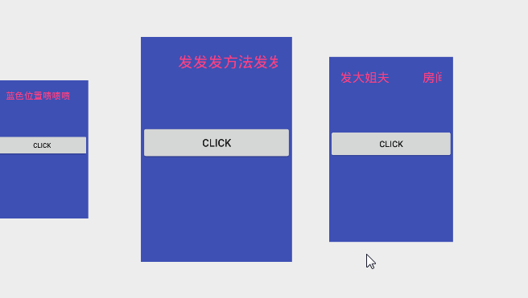
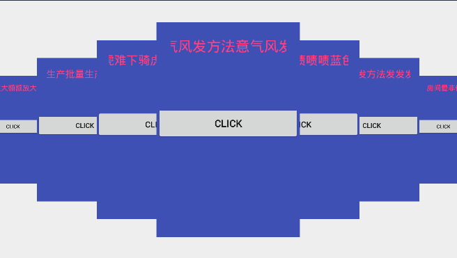
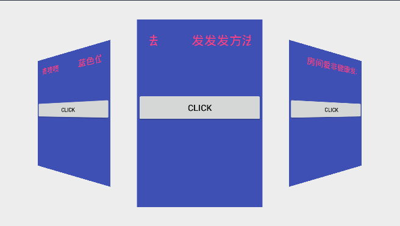
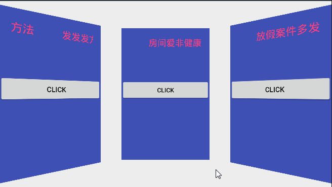

# android-magicrecyclerview
A custom view base on RecyclerView for android.

# screen-shot





# features
基于RecyclerView实现，可以用于实现 Gallery效果、叠加效果、3D旋转等效果。

# usage
### dependencies:
```
compile 'com.android.support:recyclerview-v7:26.1.0'
compile 'com.charlie.widget:magicrecyclerview:1.0.0'
```
### code:
```
mMagicRecyclerView = (MagicRecyclerView) findViewById(R.id.gly_recycler_view);
mMagicRecyclerView.setMarginOffset(10);// 设置Item之间的间距，负值时会出现叠加效果
mMagicRecyclerView.setMinAlpha(0.5f);// 设置最小的透明度变化值，默认是1（没有透明度变化效果）
mMagicRecyclerView.setMinScale(0.3f);// 设置最小的缩放变化值，默认是0
mMagicRecyclerView.setMax3DRotate(60);// 设置最大的旋转角度值，默认值是0，负值是凹陷效果，正值是突出效果
mMagicRecyclerView.setFrictionFactor(0.3f);// 设置摩擦力系数，默认值是1，越小滑动越困难。
mMagicRecyclerView.setIsyCenterChildClickable(true);// true只有中心那个Item可点击，false所有item可点击，默认为true
mMagicRecyclerView.setIsTapItemToCenter(true);// true点击某个Item之后，该Item移动到中间位置，默认为true
mMagicRecyclerView.scrollToPosition(5);// 同RV，只是滚动到的Item居中显示
mMagicRecyclerView.smoothScrollToPosition(5);// 同RV，只是滚动到的Item居中显示

```

# License
```
Copyright 2017 Charlie

Licensed under the Apache License, Version 2.0 (the "License");
you may not use this file except in compliance with the License.
You may obtain a copy of the License at

    http://www.apache.org/licenses/LICENSE-2.0

Unless required by applicable law or agreed to in writing, software
distributed under the License is distributed on an "AS IS" BASIS,
WITHOUT WARRANTIES OR CONDITIONS OF ANY KIND, either express or implied.
See the License for the specific language governing permissions and
limitations under the License.
```
